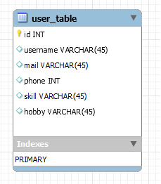
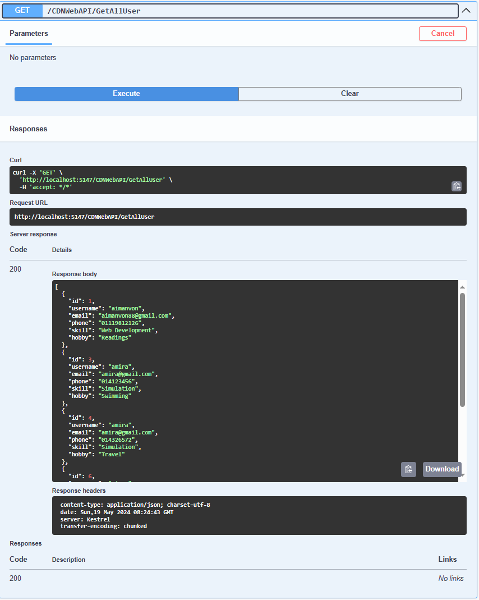
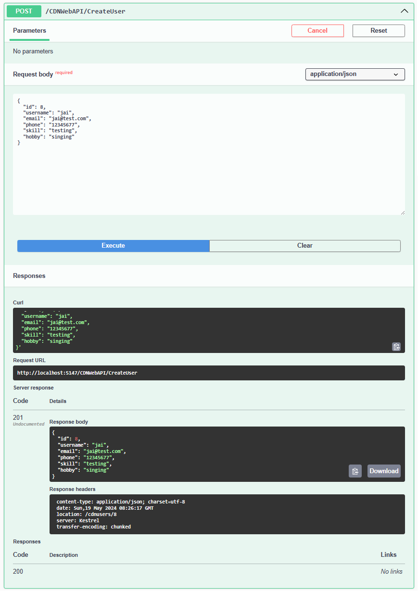
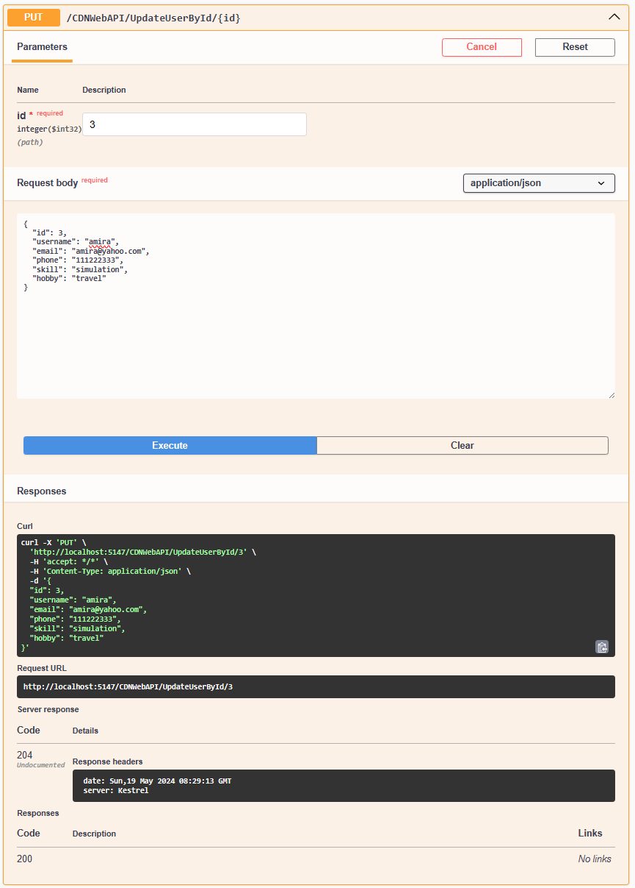

# CDN_REST_API
This is project using RESTful API ASP.Net Core Web API with Database
## Table of Contents
+ Overview
+ UI
+ Database
+ API
+ GET
+ POST
+ PUT
+ DELETE

## Overview
A project for CDN - Complete Developer Network that going to build a list of freelancers.
Such that they could have a directory of contact to get people for their job.
### The Design:

### Project Requirement:
1. Develop the RESTful API to register/delete/update/get for an user using verbs such as:
 @GET, @POST @PUT, @DELETE
2. Attributes for user model:
 username, mail, phone number, skillsets, hobby
3. Connect to RDBMS database to demonstrate data storage.
4. Build a simple interface for the above 4 operations:
 GET list of registered user name.
 Register a new user, delete a user, update a user details.
### API Description

## UI Demo

## MYSQL Demo

## API Demo

## GET Demo

## POST Demo

## PUT Demo

## DELETE Demo

