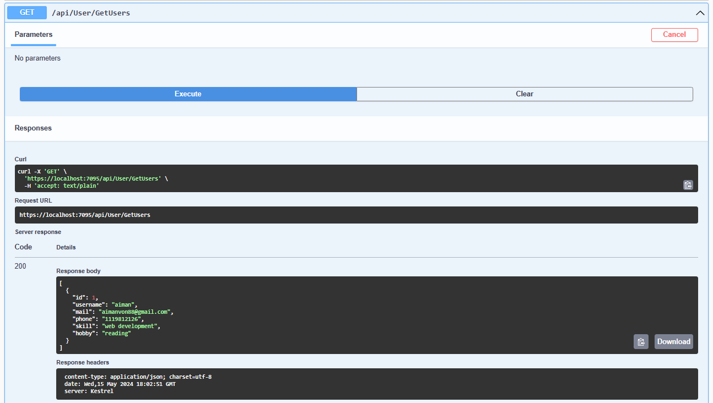

# CDN_REST_API
This is project using RESTful API.
 Expected Skillsets – ASP.Net Core Web API, Database, RESTful API,
 Client side development skill, Securing the endpoint, Caching Strategy, Pagination, Error
Handling, Testing Strategy (e.g. CI/CD, design pattern, clean architecture)
## Table of Contents
+ Overview
+ UI
+ Database
+ API
+ GET
+ POST
+ PUT
+ DELETE

## Overview
Project for CDN - Complete Developer Network is going to build a list of freelancers.
Such that they could have a directory of contact get people for their job.
1. Develop the RESTful API to register/delete/update/get for an user using verbs such as:
 @GET, @POST @PUT, @DELETE
2. The following are attributes for user model:
 username, mail, phone number, skillsets, hobby
3. Connect to RDBMS database to demonstrate data storage.
4. Build a simple interface for the above 4 operations:
 GET list of registered user name.
 Register a new user, delete a user, update a user details.

## UI Demo

## MYSQL Demo

## Swagger Demo

## GET Demo

## POST Demo

## PUT Demo

## DELETE Demo

